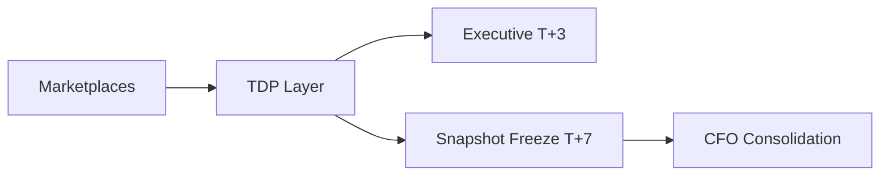

# Multi-Marketplace Reporting Architecture

## Layer Separation

- Data Sources: WB / OZON / YM
- TDP Layer: canonical tables, row/column control
- Executive Layer (T+3): operational decision support
- Snapshot Freeze (T+7): final financial fixation
- CFO Layer: consolidated PnL and unit economics

## Data Flow Diagram

## Governance Logic

No overwrite of final snapshot

Versioned reporting

Separation of operational and finalized data

Controlled financial interpretation layer
