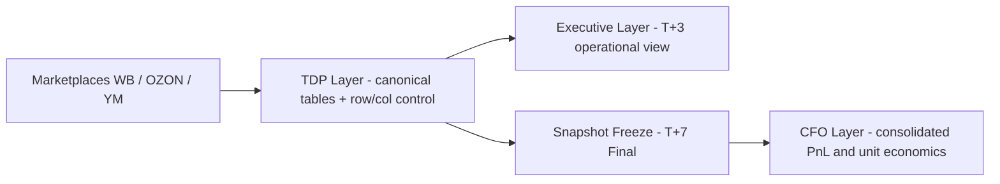

# Marketplace-MultiCab-BI-Case

Governance-driven multi-marketplace BI reporting (TDP → T+3 Executive → T+7 CFO Snapshot).

## What this case demonstrates
- Snapshot governance: Final (T+7) freeze is not overwritten
- Separation of layers: TDP (machine layer) vs Executive (T+3) vs CFO Final (T+7)
- Reproducible reporting for WB / OZON / YM

## Business problem
Marketplace dashboards can show different values between operational dates (T+3) and finalized closing (T+7).  
Without governance and freezing, teams risk making decisions on unstable numbers.

## Architecture (high-level)

## Repository structure

01_Governance/ — governance protocol and versioning rules

02_TDP_Snapshot/ — snapshot metadata (public excerpt)

03_Executive_T+3/ — executive report (T+3)

04_CFO_Final_T+7/ — final CFO snapshot (T+7)

05_Architecture/ — diagrams

## Key artifacts

Governance protocol: 01_Governance/

Snapshot metadata: 02_TDP_Snapshot/Data_Snapshot_Metadata.md

Executive report (T+3): 03_Executive_T+3/

CFO final snapshot (T+7): 04_CFO_Final_T+7/

## Strategic Impact

- Eliminated reporting instability between T+3 and T+7
- Introduced governed snapshot freeze logic
- Enabled reproducible financial consolidation across marketplaces
- Reduced risk of capital misallocation due to unstable metrics
- Separated operational decision layer from finalized financial layer

### Business Value

This architecture ensures that management decisions are based on:
- frozen financial data (T+7)
- traceable executive insights (T+3)
- controlled interpretation of unit economics

The model demonstrates structured BI thinking aligned with CFO-level reporting.

## Notes

Public repository contains only structural excerpts and methodology. Raw Data Pack tables are intentionally not published.

---

## Author

**AvseHorosho**  
BI Architect | Marketplace Analytics  
Governance-driven reporting (TDP → T+3 → T+7)  

GitHub: https://github.com/AvseHorosho
